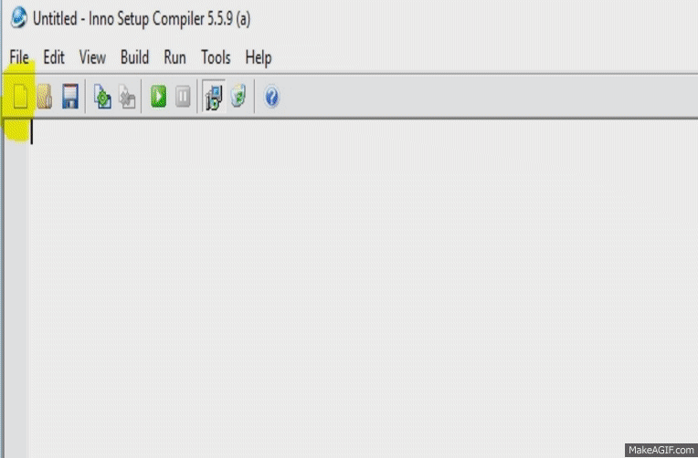

.. -*- coding: utf-8 -*-

.. _rcs_subversion:

Clase 14 - POO 2016 (No preparada aún)
===================

Creando Instalador
^^^^^^^^^^^^^^^^^^

**Mexican explanation**

|ImageLink|_ 

.. |ImageLink| image:: /images/clase14/mexicano.gif
.. _ImageLink: https://www.youtube.com/watch?v=rr6G7GU52Wc

**Capturas de pantalla de la creación**

Ejecutable del ejercicio de arrastrar y soltar la imagen
........................................................

- `Descargar Instalador de MouseMove (Windows 7 o superior - 64 bits) <https://drive.google.com/file/d/0B3bNJFNPgLHnc3ota21TVVBKb0k/view?usp=sharing>`_

- `Descargar MouseMove (Linux - 64 bits) <https://drive.google.com/file/d/0B3bNJFNPgLHnMGtzWjlQa3RIc1E/view?usp=sharing>`_

Uso de Qt Designer
..................

- Nuevo proyecto -> Qt GUI Application
- Utilizar el puntero ``ui`` para acceder a los objetos del diseño
- Tener en cuenta que los métodos virtuales de QWidget para eventos se pueden usar:

.. code-block:: c	

	virtual void mousePressEvent(QMouseEvent* event)
	virtual void resizeEvent(QResizeEvent* event)
	virtual void moveEvent(QMoveEvent* event)
	...

**Ejemplo**

.. code-block:: c	
	
	// ventana.h
	#ifndef VENTANA_H
	#define VENTANA_H

	#include <QWidget>

	namespace Ui {
	    class Ventana;
	}

	class Ventana : public QWidget  {
	    Q_OBJECT

	public:
	    explicit Ventana(QWidget *parent = 0);
	    ~Ventana();

	private:
	    Ui::Ventana *ui;
	};

	#endif // VENTANA_H

.. code-block:: c

	// ventana.cpp
	#include "ventana.h"
	#include "ui_ventana.h"

	Ventana::Ventana(QWidget *parent) : QWidget(parent), ui(new Ui::Ventana)  {
	    ui->setupUi(this);
	}

	Ventana::~Ventana()  {
	    delete ui;
	}

**Ejercicio:**

- Usar QtDesigner
- Definir la clase Ventana que herede de QWidget
- Buscar una imagen de un fútbol con formato PNG (para usar transparencias).
- Ventana tendrá un formulario que pide al usuario:
	- Diámetro del fútbol (píxeles):
	- Velocidad (mseg para ir de lado a lado):
	- QPushButton para actualizar el estado.
- El fútbol irá golpeando de izquierda a derecha en Ventana.

Clase QWebView
^^^^^^^^^^^^^^

- Es un QWidget que tiene todas las características de un navegador
- Dispone del método load() para cargar un sitio web
- Requiere la inclusión del siguiente módulo 

.. code-block:: c

	QT += webkitwidgets

**Ejercicio:** Diseñar la siguiente interfaz de usuario:

.. figure:: images/clase09/descarga.png 
 
- Mostrar el código fuente del sitio en el QTextEdit
- También incluir un QLabel para indicar el porcentaje de descarga

**Ejercicio:** Navegador - Diseñar la siguiente interfaz de usuario:

.. figure:: images/clase09/navegador.png 

- Utilizar sólo 2 widgets: un QLineEdit y un QWebView (ningún QPushButton)
- Por defecto se cargará la página de Google
- Filtrar el acceso a los dominios terminados en: edu.ar y gov.ar
- Cuando un sitio se haya filtrado mostrar el mensaje "Sitio bloqueado"

