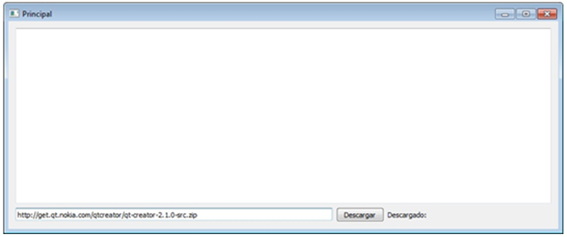

.. -*- coding: utf-8 -*-

.. _rcs_subversion:

Clase 16 - Primer Parcial (No preparada aún)
=========================

Clase QFileDialog
^^^^^^^^^^^^^^^^^

- Permite abrir un cuadro de diálogo para buscar un archivo en disco

.. code-block:: c	

	QString file = QFileDialog::getOpenFileName(this, "Abrir", "./", "Imagen (*.png *.jpg)");

**Ejercicio:**

- Elegir un archivo de imagen del disco con ``QFileDialog`` y dibujarlo en un ``QWidget``.
- Agregar un botón "Iniciar rotación" que genere la rotación de la imagen sobre su centro.

**Ejercicio:** Al ingresar la URL de una imagen deberá mostrarla como en la figura

.. figure:: images/clase10/imagenes.png  
 
- Al hacer clic sobre una de estas imágenes, deberá ocultarse la misma. 
- Cuando se oculta la segunda imagen, cerrar la aplicación.

Creando Instalador
^^^^^^^^^^^^^^^^^^

**Mexican explanation**

|ImageLink|_ 

.. |ImageLink| image:: /images/clase14/mexicano.gif
.. _ImageLink: https://www.youtube.com/watch?v=rr6G7GU52Wc

**Capturas de pantalla de la creación**

.. figure:: images/clase14/CrearInstalador.gif

Ejecutable del ejercicio de arrastrar y soltar la imagen
........................................................

- `Descargar Instalador de MouseMove (Windows 7 o superior - 64 bits) <https://drive.google.com/file/d/0B3bNJFNPgLHnc3ota21TVVBKb0k/view?usp=sharing>`_

- `Descargar MouseMove (Linux - 64 bits) <https://drive.google.com/file/d/0B3bNJFNPgLHnMGtzWjlQa3RIc1E/view?usp=sharing>`_

**Ejercicio:**

- Diseñar una aplicación que muestre en un ``QWidget`` cualquier imagen de 50x50
- La imagen deberá seguir al puntero del mouse cuando esté presionado un botón.
- Utilizar ``QTimer`` para actualizar la posición de la imagen dando un efecto inercial

Clase QWebView
^^^^^^^^^^^^^^

- Es un QWidget que tiene todas las características de un navegador
- Dispone del método load() para cargar un sitio web
- Requiere la inclusión del siguiente módulo 

.. code-block:: c

	QT += webkitwidgets

**Ejercicio:** Diseñar la siguiente interfaz de usuario:

 
- Mostrar el código fuente del sitio en el QTextEdit
- También incluir un QLabel para indicar el porcentaje de descarga

**Ejercicio:** Navegador - Diseñar la siguiente interfaz de usuario:

.. figure:: images/clase09/navegador.png 

- Utilizar sólo 2 widgets: un QLineEdit y un QWebView (ningún QPushButton)
- Por defecto se cargará la página de Google
- Filtrar el acceso a los dominios terminados en: edu.ar y gov.ar
- Cuando un sitio se haya filtrado mostrar el mensaje "Sitio bloqueado"

.. figure:: images/clase16/imagenes-para-reirse-en-los-examenes.jpg

****

.. figure:: images/clase16/yeah.gif

****

Aplicación para replicar en Primer Parcial
..........................................

Usuario válido: cgomez:123456

- `Ejecutable (Windows 7 o superior - 64 bits) <https://drive.google.com/file/d/0B3bNJFNPgLHnTVd6SGl2cERReWc/view?usp=sharing>`_

- `Ejecutable (Linux - 64 bits) <https://drive.google.com/file/d/0B3bNJFNPgLHneUhiQmNjTFdldkU/view?usp=sharing>`_

