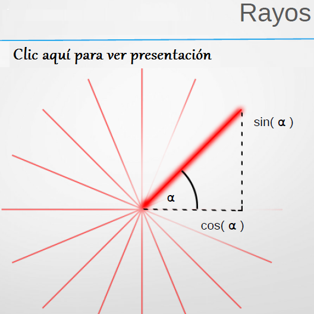

.. -*- coding: utf-8 -*-

.. _rcs_subversion:

Clase 20 - POO 2016
===================

Rotación de la escena
^^^^^^^^^^^^^^^^^^^^^

- Gira un ángulo en sentido contrario a las agujas del reloj.
- Sobre el eje formado desde el origen hasta el punto (x, y, z).

.. code-block:: c

	// glRotatef(angulo, x, y, z); 
	glRotatef(5, 0, 0, 1);  // gira 5° con respecto al eje z

Traslación de la escena
^^^^^^^^^^^^^^^^^^^^^^^

- Desplaza el punto (0, 0, 0) a la nueva posición (x, y, z).

.. code-block:: c

	// glTranslatef(x, y, z);
	glTranslatef(2, 0, 0);  // Desplaza 2 unidades en el eje x

Escalado de la escena
^^^^^^^^^^^^^^^^^^^^^

- Escala. Con valores mayores a 1, se amplía. Entre 0 y 1 se reduce.

.. code-block:: c

	// glScalef(x, y, z);
	glScalef(1, 2, 1);  // escala el doble en vertical
	
	
Objetos ocultos
^^^^^^^^^^^^^^^

- En 3D un objeto puede estar detrás de otro.
- Por defecto, OpenGL no tiene en cuenta esto. Pinta siguiendo el orden en el código fuente,.
- El siguiente código no se vería muy real:

.. code-block:: c

	glColor3f(0, 1, 0);
	glBegin(GL_TRIANGLES);
	    glVertex3f(-5, -5, 5);
	    glVertex3f(0, 0, 0);
	    glVertex3f(5, -5, 5);
	glEnd();

	glColor3f(0, 0, 1);
	glPointSize(5);
	glBegin(GL_POINTS);
	    glVertex3f(0, -1, 0);
	    glVertex3f(0, -2, 5);
	glEnd();

- Para solucionar activamos el buffer de profundidad

.. code-block:: c

	glEnable(GL_DEPTH_TEST); 

- Cada vez que se renderiza la escena, limpiamos la pantalla

.. code-block:: c

	glClear(GL_COLOR_BUFFER_BIT | GL_DEPTH_BUFFER_BIT);

Seguimiento continuo del mouse
^^^^^^^^^^^^^^^^^^^^^^^^^^^^^^

- Al usar ``mouseMoveEvent`` ¿por qué sólo se sigue al mouse al presionar un botón?

.. code-block:: c

	setMouseTracking(bool enable)

- Es un método de la clase QWidget
- Activa el seguimiento continuo del mouse sobre un QWidget.
- Por defecto se encuentra desactivado.
- Cuando está desactivado sólo se reciben los eventos del movimiento del mouse cuando al menos se presiona un botón del mismo.

**Ejercicio:**

- Dibujar un cajón deforme sin tapa con un color distinto en cada lado.
- Utilizar el teclado para hacerlo rotar sobre los tres ejes.

MiniExámenes
============

- Se promediarán para la tercer nota de POO
- Previstos: May 27 - May 31 - Jun 7 - Jun 10 - Jun 14
- Tiempo: 30 minutos
- Temas para el 27 de mayo: 
	- Login
	- Validación contra base de datos
	- Crear el GUI del login con QtDesigner
	- MD5
	- Registro de logs en base de datos
	- Obtener fecha y hora del sistema

Ejercitando con Emi Kohmann
^^^^^^^^^^^^^^^^^^^^^^^^^^^

- `Esqueleto OpenGL <https://github.com/cosimani/Curso-POO-2016/blob/master/sources/clase20/poo_empty.rar?raw=true>`_

- `Ejemplo de las Ruedas <https://github.com/cosimani/Curso-POO-2016/blob/master/sources/clase20/ruedas.rar?raw=true>`_

**Ejercicio:**

- Realizar el cierre convexo de los extremos de los rayos, para convertir los rayos en una rueda.
- Realizar una matriz de ruedas cerradas, donde cada rueda gire hacia el sentido opuesto de las ruedas adyacentes.

