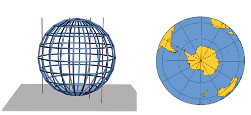

.. -*- coding: utf-8 -*-

.. _rcs_subversion:

Clase 20 - POO 2017
===================

:Tarea para Clase 22:
	Ver `Tutorial Qt QFile <https://www.youtube.com/watch?v=zDA5FKfRxJA>`_ de `Videos tutoriales de Qt <https://www.youtube.com/playlist?list=PL54fdmMKYUJvn4dAvziRopztp47tBRNum>`_

	Ver `Tutorial Qt QDir <https://www.youtube.com/watch?v=wfabCN1oJpE>`_ de `Videos tutoriales de Qt <https://www.youtube.com/playlist?list=PL54fdmMKYUJvn4dAvziRopztp47tBRNum>`_

	Ver `Tutorial Qt Resource file <https://www.youtube.com/watch?v=u8xKE0zHLsE>`_ de `Videos tutoriales de Qt <https://www.youtube.com/playlist?list=PL54fdmMKYUJvn4dAvziRopztp47tBRNum>`_	

	Repasar todo lo que está en GitHub sobre OpenGL hasta la clase 19

Modelo de sombreado
^^^^^^^^^^^^^^^^^^^

- Lo especificamos con la función ``glShadeModel()``. ``(shade = tono - matiz)``
- Si el parámetro es ``GL_FLAT`` se rellena con el úlimo color activo. ``(flat = plano)``
- Con ``GL_SMOOTH`` se interpolan los colores de cada vértice. ``(smooth = suavizar)``

.. code-block:: c
     
	glShadeModel(GL_SMOOTH);	
	glBegin(GL_TRIANGLES);
	    glColor3f(1, 0, 0); // activamos el color rojo
	    glVertex3f(-1.0f, -0.5f, 0.0f);
	    glColor3f(0, 1, 0); // activamos el color verde
	    glVertex3f(1.0f, 0.0f, 0.0f);
	    glColor3f(0, 0, 1); // activamos el color azul
	    glVertex3f(0.3f, 1.0f, 0.0f);
	glEnd();

**Transformación de viewport (o vista)**

- Análogamente con una cámara de fotos, es el tamaño de la fotografía.
- Generalmente se inicializa para que ocupe toda la ventana.
- Pensar en la relación ancho / alto.

.. code-block:: c

	void glViewport(GLint x, GLint y, GLsizei width, GLsizei height);
	
**Proyecciones**

- La proyección define el volumen del espacio que va a usarse para formar la imagen.
- Los vértices de la escena es afectada por la matriz de proyección.
- Es necesario activarla e inicializarla:

.. code-block:: c

	glMatrixMode(GL_PROJECTION);
	glLoadIdentity();

**Proyección ortogonal**

- Define un volumen de la vista como una "caja".
- La distancia de un objeto a la cámara no influye en su tamaño.

.. code-block:: c

	void glOrtho(GLdouble left, GLdouble right, GLdouble bottom, GLdouble top, GLdouble near, GLdouble far)

.. figure:: images/clase21/ortogonal.png

**Proyección perspectiva**

- Define un volumen de la vista como una pirámide truncada (o frustum).
- Los objetos aparecen más pequeños mientras más alejados están de la cámara.

.. code-block:: c

	void glFrustum(GLdouble left, GLdouble right, GLdouble bottom, GLdouble top, GLdouble near, GLdouble far)
	
.. figure:: images/clase21/frustum.png	

.. code-block:: c

	void gluPerspective(angulo, aspecto, znear, zfar);

.. figure:: images/clase21/perspective.png	

- Es muy común usar:

.. code-block:: c

	gluPerspective(45.0f,(GLfloat)(width/height), 0.01f, 100.0f);
	// donde width y height es el ancho y alto de la escena

- Para utilizar ``gluPerspective`` es necesario linkear a la librería en el .pro:

.. code-block:: c
	
	// Para Linux
	unix:LIBS += "/usr/lib/x86_64-linux-gnu/libGLU.so"

	// Para Windows
	win32::LIBS += -lGLU	

	// Posiblemente también requiera incluir el archivo de cabecera:
	#include <GL/glu.h>

**Ejercicio:**

- Dibujar un triángulo dentro del campo de visión de la escena.
- Active un temporizador (100 ms) para que gire 3° el triángulo sobre el eje z.	
		   

**Posicionando la cámara**

- La siguiente función realiza el efecto del posicionamiento de la cámara.

.. code-block:: c

	void gluLookAt(GLdouble ojoX, GLdouble ojoY, GLdouble ojoZ, 
	               GLdouble haciaX, GLdouble haciaY, GLdouble haciaZ, 
	               GLdouble upX, GLdouble upY, GLdouble upZ)
				   
.. figure:: images/clase22/lookat.png		

**Ejercicio:**

- Marcar 4 puntos en la escena donde se haga clic con el mouse.
- Ni bien se marque el 4to, automáticamente se generará el polígono de 4 vértices.
- Con la tecla C se puede cambiar entre distintos colores de relleno.
- Con A y D se rota sobre el eje Y.
- Con W y S se rota sobre el eje X.

**Ejercicio:**

- Dibujar un cuadrado cualquiera en el plano z=-2.
- Controlar la posición de la cámara con las teclas.
- La cámara siempre vertical y mirando al punto (0, 0, -100).

**Ejercicio:**

- Dibujar una ruta con la línea blanca interrumpida.
- Con las teclas Up y Down acelerar y frenar

Funciones inline
================

- Cuando decimos que llamamos a una función es porque salta, ejecuta y retorna.
- Una función inline inserta su código.
- Ventaja de ejecutarse más rápidamente.
- Como desventaja tenemos un programa generado más extenso.

.. code-block:: c

	#include <QDebug>
	#include <QApplication>

	inline int calculo(int a, int b)  {
	    return a/2+b;
	}

	int main(int argc, char** argv)  {
	    QApplication a(argc, argv);

	    int x=2, y=3, z=0;
	    z = calculo(x, y);

	    return 0;
	}

**Funciones miembro inline dentro de clases**

- Un método se declara dentro del cuerpo de la clase y se puede definir dentro o fuera
- Si se declara y define dentro, se denomina función inline. En este caso, no hace falta indicar con inline (está implícito).
- Si se define fuera, deberá indicar inline. De lo contrario será offline.
- Se recomienda usar funciones inline para funciones pequeñas y de uso frecuente.

.. code-block:: c

	#include <QDebug>
	#include <QApplication>

	class ClaseA  {
	private:
	    int x;
	    int y;

	public:
	    ClaseA() : x(10), y(20)  {  }
	    int getX()  {  return x;  }     // inline implícito
	    int getY();
	};

	inline int ClaseA::getY()  {
	    return y;
	}

	int main(int argc, char** argv)  {
	    QApplication a(argc, argv);

	    ClaseA cA;
	    qDebug() << cA.getX();
	    qDebug() << cA.getY();

	    return 0;
	}
	

Declaraciones friend
====================

- Miembros privados no son accesibles para funciones y clases externas
- Podemos usar friend en caso de necesitar acceder
- Se pueden aplicar a clases o métodos
- Inhabilitan el sistema de protección (protected o private)
- La amistad no es transferible

.. code-block:: c
	
	A es amigo de B     B amigo de C     No por eso A es amigo de C

- No se hereda

.. code-block:: c

	A amigo de B     C derivada de B     No por eso A es amigo de C

- No simétrica

.. code-block:: c

	A amigo de B     No por eso B es amigo de A

**Funciones amigas**

.. code-block:: c

	#include <iostream>
	using namespace std;

	class ClaseA  {
	public:
	    ClaseA(int i) : a(i)  {  }
	    void verA()  {  cout << a << endl;  }

	protected:
	    int a;
	    friend void mostrarA(ClaseA);  // mostrarA es amiga de ClaseA
	};

	void mostrarA(ClaseA cA)  {  // Esta función no pertenece a ClaseA
	    cout << cA.a << endl;   // Pero al ser amiga puede acceder a 'a'
	}

	int main(int argc, char** argv)  {
	    ClaseA objetoA(10);
	    mostrarA(objetoA);
	    objetoA.verA();

	    return 0;
	}
 
**Función amiga en otra clase**

.. code-block:: c

	#include <iostream>
	using namespace std;

	class ClaseA;	// Declaración

	class ClaseB  {
	public:
	    ClaseB(int i) : b(i)  {  }
		
	    void ver()  { cout << b << endl;  }
		
	    bool esMayor(ClaseA cA)  {  // Compara
	        return b > cA.a;
	    }
		
	private:
	    int b;
	};

	class ClaseA  {
	public:
	    ClaseA(int i) : a(i)  {  }
	    void ver()  { cout << a << endl; }

	private:
	    friend bool ClaseB::esMayor(ClaseA);
	    int a;
	};

	int main(int argc, char** argv)  {
	    ClaseA objetoA(10);
	    ClaseB objetoB(2);

	    objetoA.ver();	
	    objetoB.ver();

	    if (objetoB.esMayor(objetoA))
	        cout << "objetoB > objetoA" << endl;
	    else
	        cout << "objetoB < objetoA" << endl;

	    return 0;
	}
	
Levantar base de datos a QTableView
===================================

- Colocar con el QtDesigner un QTableView

.. code-block:: c

	QSqlRelationalTableModel * tableModelAlumnos;
	tableModelAlumnos = new QSqlRelationalTableModel(this, adminDB->getDB()); 

	tableModelAlumnos->setTable("alumnos");  // Tabla de la base

	// Para modificar como una planilla de excel
	tableModelAlumnos->setEditStrategy(QSqlTableModel::OnManualSubmit); 

	// Otra relación. En lugar de mostrar el id_carrera que muestre el nombre de la carrera.
	tableModelAlumnos->setRelation(5, QSqlRelation("carreras", "id", "nombre"));

	tableModelAlumnos->select();  // Hace la consulta.

	// Títulos de las columnas en el widget.
	tableModelAlumnos->setHeaderData(1, Qt::Horizontal, "Legajo");
	tableModelAlumnos->setHeaderData(2, Qt::Horizontal, "Nombre");
	tableModelAlumnos->setHeaderData(3, Qt::Horizontal, "Apellido");
	tableModelAlumnos->setHeaderData(4, Qt::Horizontal, "Mail");
	tableModelAlumnos->setHeaderData(5, Qt::Horizontal, "Carrera"); 

	// Seteamos el QSqlTableModel sobre el QTableView
	ui->tableViewAlumnos->setModel(tableModelAlumnos);

	// Lista desplegable con el nombre de la carrera, esto cuando se modifique la celda.
	ui->tableViewAlumnos->setItemDelegate(new QSqlRelationalDelegate(ui->tableViewAlumnos));

	// Ocultamos la columna id de la tabla alumnos.
	ui->tableViewAlumnos->setColumnHidden(0, true);

	// Ajusta el ancho de la celda con el texto en su interior. Para todas las columnas.
	ui->tableViewAlumnos->resizeColumnsToContents(); 
	
.. code-block:: c

	void Principal::slot_guardarCambios()  {    // Guada todos los cambios 
	    tableModelAlumnos->submitAll();
	}

	void Principal::slot_deshacer()  {  // Deshace todos los cambios que hizo el usuario.
	    tableModelAlumnos->revertAll();
	}

**Ejercicio**

- Hacerlo funcionar mostrando la tabla usuarios y su relación con tabla carreras
- Tabla alumnos: id, legajo, nombre, apellido, mail, id_carrera
- Tabla carreras: id, nombre
- Usar QtDesigner
		

