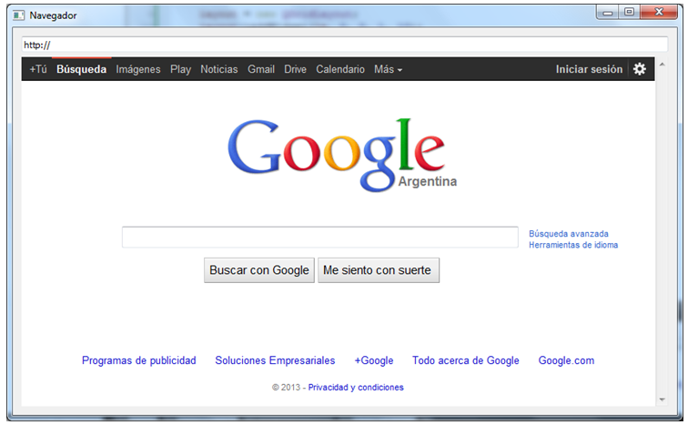
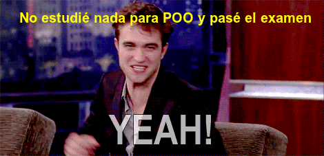

.. -*- coding: utf-8 -*-

.. _rcs_subversion:

Clase 21 - POO 2016 (No preparada aún)
===================

MiniExámenes
============

- Se promediarán para la tercer nota de POO
- Previstos: May 31 - Jun 7 - Jun 10 - Jun 14
- Tiempo: 30 minutos
- Temas para el 31 de mayo: 
	- Descarga de imágenes de internet
	- Google Maps y Google StreetView
	- Promoción en QtDesigner
	- Crear el GUI con QtDesigner para visualizar las imágenes en un QWidget
	
	
Clase QWebView
^^^^^^^^^^^^^^

- Es un QWidget que tiene todas las características de un navegador
- Dispone del método load() para cargar un sitio web
- Requiere la inclusión del siguiente módulo 

.. code-block:: c

	QT += webkitwidgets

**Ejercicio:** Diseñar la siguiente interfaz de usuario:

.. figure:: images/clase09/descarga.png 
 
- Mostrar el código fuente del sitio en el QTextEdit
- También incluir un QLabel para indicar el porcentaje de descarga

**Ejercicio:** Navegador - Diseñar la siguiente interfaz de usuario:

- Utilizar sólo 2 widgets: un QLineEdit y un QWebView (ningún QPushButton)
- Por defecto se cargará la página de Google
- Filtrar el acceso a los dominios terminados en: edu.ar y gov.ar
- Cuando un sitio se haya filtrado mostrar el mensaje "Sitio bloqueado"

.. figure:: images/clase16/imagenes-para-reirse-en-los-examenes.jpg

****

****

Aplicación para replicar en Primer Parcial
..........................................

Usuario válido: cgomez:123456

- `Ejecutable (Windows 7 o superior - 64 bits) <https://drive.google.com/file/d/0B3bNJFNPgLHnTVd6SGl2cERReWc/view?usp=sharing>`_

- `Ejecutable (Linux - 64 bits) <https://drive.google.com/file/d/0B3bNJFNPgLHneUhiQmNjTFdldkU/view?usp=sharing>`_

MiniExámenes
============

- Se promediarán para la tercer nota de POO
- Previstos: May 27 - May 31 - Jun 7 - Jun 10 - Jun 14
- Tiempo: 30 minutos
- Temas para el 27 de mayo: 
	- Login
	- Validación contra base de datos
	- Crear el GUI del login con QtDesigner
	- MD5
	- Registro de logs en base de datos
	- Obtener fecha y hora del sistema

Ejercitando con Emi Kohmann
^^^^^^^^^^^^^^^^^^^^^^^^^^^

.. figure:: images/clase20/presentacion.png
	:target: resources/clase20/presentacion.pdf

- `Esqueleto OpenGL <https://github.com/cosimani/Curso-POO-2016/blob/master/sources/clase20/poo_empty.rar?raw=true>`_

- `Ejemplo de las Ruedas <https://github.com/cosimani/Curso-POO-2016/blob/master/sources/clase20/ruedas.rar?raw=true>`_

**Ejercicio:**

- Realizar el cierre convexo de los extremos de los rayos, para convertir los rayos en una rueda.
- Realizar una matriz de ruedas cerradas, donde cada rueda gire hacia el sentido opuesto de las ruedas adyacentes.

